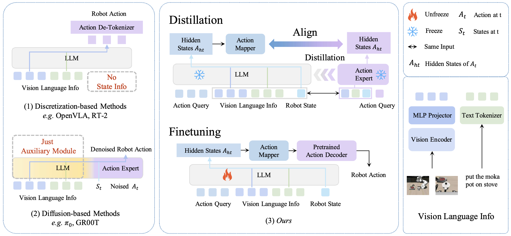
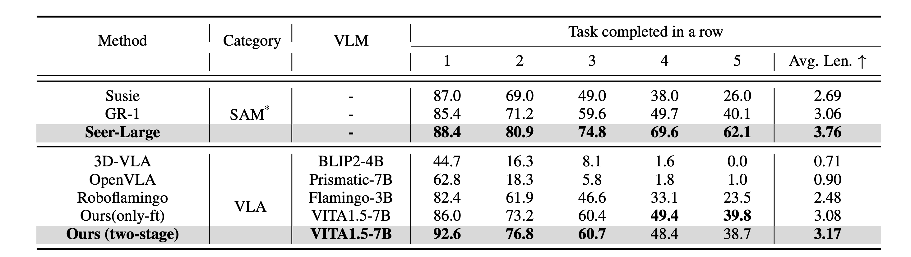
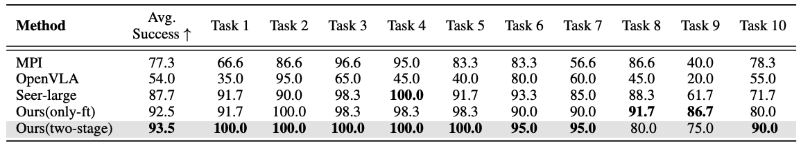
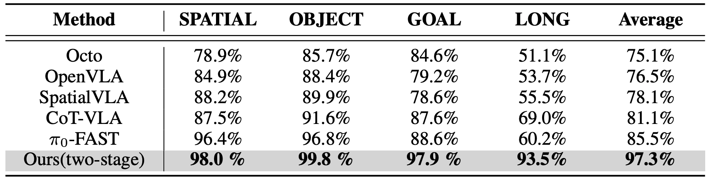
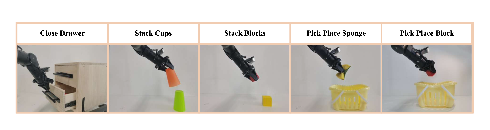
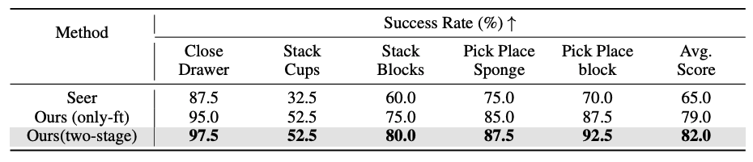

# VITA-VLA: Efficiently Teaching Vision-Language Models to Act via Action Expert Distillation

<div align="center">
  📖 <a href="https://arxiv.org/abs/2510.09607">Paper</a> · 🤖 <a href="https://huggingface.co/ShaoqiDong/VITA-VLA/">Model Weights</a> · 🚀 <a href="https://ltbai.github.io/VITA-VLA/">Live Demo</a>
</div>

<p align="center">
  | <a href="#-method-overview"><b>🗺️ Overview</b></a> 
  | <a href="#-benchmark-results"><b>📊 Benchmark</b></a> 
  | <a href="#-real-world-experiment"><b>🌍 Real-World</b></a> 
  | <a href="#-get-started"><b>⚡ Quick Start</b></a> 
  |
</p>

We are thrilled to announce the launch of VITA-VLA — a powerful and streamlined vision-language-action (VLA) model that combines architectural simplicity with highly efficient training. Designed to unlock the full potential of pretrained vision-language models in embodied AI tasks. VITA-VLA introduces a novel two-stage training strategy, enabling superior performance with minimal computational overhead. Whether in simulation or real-world robotic scenarios, VITA-VLA delivers state-of-the-art results.


### ✨ Highlights

- **Efficient Training**: Lightly align VLM hidden states with pretrained action models, then fine-tune for accurate action generation.
- **Simple Architecture**: Add only minimal layers — state encoder and query token.
- **Strong Performance**: Outperform most VLAs on CALVIN ABC-D and LIBERO.
  <br clear="left"/>

## 🧠 Method Overview

<div align="center">
  
</div>

**Overview of mainstream VLA architectures.**

1. **Discretization-based methods** convert actions into tokens and directly decode them using visual and language features, but omit **robot state information**, which is crucial for physical dynamics.
2. **Diffusion-based approaches** extract vision-language features with a VLM, but offload action generation to an action expert, making the VLM a passive feature extractor.
3. **Our method** introduces a **state encoder** and **action query token**, retains the full VLM, and distills knowledge from an expert model to achieve high reasoning and efficiency.

## 📈 Benchmark Results

**CALVIN ABC-D**

<div align="center">
    
</div>

Our model demonstrates strong zero-shot generalization to unseen environments, achieving higher overall performance compared with existing VLA models. This highlights both the effectiveness of our two-stage distillation strategy and the importance of fine-tuning the VLM for action execution.

**LIBERO-LONG**

<div align="center">
    
</div>

Our model achieves state-of-the-art performance, with a 5.8\% improvement over Seer-Large and a 1\% improvement over the fine-tuning-only strategy. These results validate the effectiveness of our approach in handling long-horizon tasks and complex instruction-following scenarios.

**LIBERO**

<div align="center">
    
</div>

Our model achieves the highest average success rate across all task suites, outperforming existing VLA models by a significant margin. In particular, it improves the previous best result on LIBERO-LONG by 24.5\%, reaching a 97.3\% success rate. These findings demonstrate that our framework effectively combines the reasoning capacity of large-scale VLMs with the efficient action modeling of small action models.

## 🌍 Real-World Experiment

### 🛠️ Task Setup

<div align="center">
  
</div>

- Platform: **ALOHA**
- Control: 6-DoF arm + 1-D gripper width
- Tasks: Pick, Place, Close, Stack

### 🎬 Execution Demo

<div align="center">
  
</div>

**Instructions:**

1. "Close the drawer"
2. "Stack the orange cup on top of the green cup"
3. "Stack the red block on top of the yellow block"
4. "Pick up the sponge and put it into the basket"
5. "Pick up the red block and put it into the basket"

### 📊 Real-World Results Summary

<div align="center">
  
</div>

VITA-VLA achieves top performance across all tasks, demonstrating the strongest results in long-horizon and stacking scenarios, and validating its two-stage training strategy.

## 📔 Get Started

### Prepare Environment

- **Python**: 3.9–3.12
- **PyTorch**: ≥ 1.13
- **CUDA**: 11.8+
- **OS**: Ubuntu 20.04+

Please refer to [Seer](https://github.com/InternRobotics/Seer) and [VITA](https://github.com/VITA-MLLM/VITA) for environment configuration, and download the corresponding weights.

#### [Seer](https://github.com/InternRobotics/Seer)

```bash
conda create -n vita_vla python=3.10 -y
conda activate vita_vla
git clone https://github.com/InternRobotics/Seer.git
cd Seer
pip install -r requirements.txt
Please refer to following the instructions to prepare calvin and LIBERO environment and download the corresponding weights.
```

#### [VITA](https://github.com/VITA-MLLM/VITA)

```bash
git clone https://github.com/VITA-MLLM/VITA.git
cd VITA
pip install -r requirements.txt
pip install flash-attn --no-build-isolation
```

Download:

- https://huggingface.co/VITA-MLLM/VITA-1.5

### 🎲 Training

We use the CALVIN ABC-D experiment as an example. LIBERO scripts are also provided in the `scripts/` directory.

#### Strategy 1:

```bash

Stage 1: Alignment
bash scripts/CALVIN_ABC_D/pretrain_frevlm.sh

Stage 2: Finetune
bash scripts/CALVIN_ABC_D/ft_nofrevlm_pt_frevlm_from_2pth.sh
Set `finetune_from_pretrained_ckpt` to alignment weights
```

#### Strategy 2: Finetune Only

```bash
bash scripts/CALVIN_ABC_D/ft_wopt_nofrevlm.sh
```

#### Strategy 3: Freeze VLM

```bash
bash scripts/CALVIN_ABC_D/ft_wopt_from_seer.sh
Use transfer.py to transfer the full weights to a small ckpt we need
Set `finetune_from_pretrained_ckpt` to the transfered VITA-VLA weights(only action modules)
```

>

### 🔎 Evaluation

```bash
bash scripts/CALVIN_ABC_D/eval_ft_nofrevlm_pt_frevlm_from_2pth.sh
Set `resume_from_checkpoint` to your trained weights
```

## 📝 Citation

If you find our work helpful for your research, please consider citing the following BibTeX entry.

```bibtex
@article{dong2025vita-vla,
      title={VITA-VLA: Efficiently Teaching Vision-Language Models to Act via Action Expert Distillation},
      author={Shaoqi Dong and Chaoyou Fu and Haihan Gao and Yi-Fan Zhang and Chi Yan and Chu Wu and Xiaoyu Liu and Yunhang Shen and Jing Huo and Deqiang Jiang and Haoyu Cao and Yang Gao and Xing Sun and Ran He and Caifeng Shan},
      journal={arXiv preprint arXiv:2501.01957},
      year={2025}
}
```

## 🙏 Acknowledgements

- [VITA](https://github.com/VITA-MLLM/VITA)
- [Seer](https://github.com/InternRobotics/Seer)
- [CALVIN](https://github.com/mees/calvin)
- [LIBERO](https://github.com/LIBERO-Projects/LIBERO)
