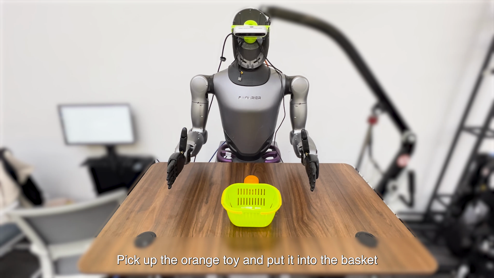
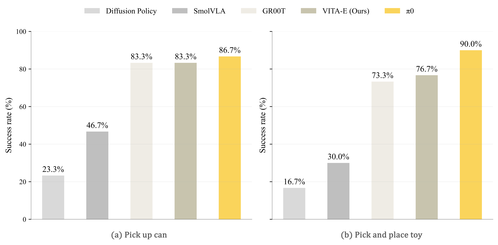

# VITA-E: Natural Embodied Interaction with Concurrent Seeing, Hearing, Speaking, and Acting


<div align="center">
  📖 <a href="https://arxiv.org/abs/2510.xxx">Paper</a> · 🤖 <a href="https://huggingface.co/VITA-MLLM/VITA-E">Model Weights</a> · 🚀 <a href="https://www.youtube.com/watch?v=05UJ-AV2o1Q">Live Demo</a>
</div>

<p align="center">
  | <a href="#-vita-e-overview"><b>🗺️ Overview</b></a> 
  | <a href="#-experimental-results"><b>📊 Experimental Results</b></a> 
  | <a href="#-get-started"><b>⚡ Get Started</b></a> 
  | <a href="#-inference-demo"><b>💻 Inference & Demo</b></a> 
  | <a href="#-training"><b>🔥 Training</b></a> 
  |
</p>


<p align="center">
  <br>
  VITA-E can handle various complex interactive scenarios, including concurrency and nearly real-time interruption.<br>
  <a href="https://www.youtube.com/watch?v=05UJ-AV2o1Q">📽 VITA-E Demo Show! Here We Go! 🔥</a><br>
</p>

## 🗺️ VITA-E Overview

<table>
  <tr>
    <td width="320">
      
    </td>
    <td>

We are excited to present **VITA-E**, which incorporates a series of advancements:

1. **Dual-Model Framework for Seamless Interaction**. VITA-E introduces a groundbreaking dual-model core, where an "Active Model" executes tasks while a "Listening Model" stands ready for new commands.

2. **Innovative "Model-as-Controller" Paradigm**. We pioneer a "model-as-controller" approach where the Vision-Language Model is fine-tuned to generate special tokens that function as direct system-level commands, enabling precise, reliable, and immediate control over system actions.

3. **Smooth Human-Computer Interaction**. By this manner, VITA-E supports smooth two-way voice interaction, allows replies while executing, voice interruption during actions, and natural action transition. Besides, VITA-E supports both English and Chinese.

4. **Strong Performance in Critical Interactive Scenarios**. Tested on a physical humanoid robot, VITA-E demonstrated exceptional reliability and responsiveness. It achieves a high success rate across multiple interactive and operational tasks and is compatible with a wide range of mainstream VLA models.

    </td>
  </tr>
</table>

## 📊 Experimental Results

- **Success rate comparison of VITA-E and baseline models on two fundamental manipulation tasks.**

<p align="center">
    
</p>

- **Key Interactive Performance.**

<div align="center">

<table>
  <thead>
    <tr>
      <th>Speech Interruption</th>
      <th>Task Switching</th>
      <th>Emergency Stop</th>
      <th>Avg. voice response latency</th>
    </tr>
  </thead>
  <tbody>
    <tr>
      <td>100%</td>
      <td>93.3%</td>
      <td>100%</td>
      <td>2.26s</td>
    </tr>
  </tbody>
 </table>

</div>


## ⚡ Get Started

Install conda environment.

```
git clone https://github.com/VITA-MLLM/VITA-E
cd VITA-E
conda create -n vita_e python=3.10 -y
conda activate vita_e
pip install --upgrade pip
pip install -r vita_e_requirements.txt
pip install flash-attn --no-build-isolation
```

Download the required model weights to local path: [VITA-E](https://huggingface.co/VITA-MLLM/VITA-E).

```bash
huggingface-cli download VITA-MLLM/VITA-E --local-dir checkpoints/VITA-E
```

## 💻 Inference & Demo

### 📍 Inference

Run the inference script.

```bash
python inference_vita_e.py \
--model_path_vlm checkpoints/VITA-E/vita_vla_finetune \
--model_path_policy checkpoints/VITA-E/vita_gr00t_robot
```

### 📍 Demo

#### Web Demo

You can interact with our VITA-E web demo with mocked robot state data to experience the features, with no need of any embodied robot entity. (A total of 48 GB GPU memory is needed.)

Prepare a VAD (Voice Activity Detection) module. 
You can choose to download [silero_vad.onnx](https://github.com/snakers4/silero-vad/tree/v4.0/files) and [silero_vad.jit](https://github.com/snakers4/silero-vad/tree/v4.0/files), and place these files in the `./demo/wakeup_and_vad/resource/` directory.

```bash
python -m vita_e.server_vla_vita \
--model_path_vlm checkpoints/VITA-E/vita_vla_finetune \
--model_path_policy checkpoints/VITA-E/vita_gr00t_robot \
--ip 0.0.0.0 \
--port 8081
```

Wait about three minutes to completely load all modules. Open `127.0.0.1:8081` website on you server and enjoy it.

#### Real Robot Demo

Deploy server script on your server.

```bash
python -m vita_e.server_vla_vita \
--model_path_vlm checkpoints/VITA-E/vita_vla_finetune \
--model_path_policy checkpoints/VITA-E/vita_gr00t_robot \
--ip 0.0.0.0 \
--port 8081
```

Start client script on the robot client.

```bash
cd demo
python vla_robot_client.py
```

## 🔥 Training

Our VITA-E model is built upon the VITA-1.5 and Isaac-GR00T architectures. We leverage VITA-1.5 as the VLM component and integrate Isaac-GR00T's pre-trained diffusion action expert as the action model.

The training process involves two stages: first, we fine-tune the VLM component and integrate it into the Isaac-GR00T framework by replacing the original VLM; then, we perform end-to-end fine-tuning on the complete model using VLA data.

Please refer to [VITA-1.5](https://github.com/VITA-MLLM/VITA) and [Isaac-GR00T](https://github.com/NVIDIA/Isaac-GR00T) for more details.

## ✒️ Citation

If you find our work helpful for your research, please consider citing our work.   

```bibtex
@article{liu2025vitae,
  title={VITA-E: Natural Embodied Interaction with Concurrent Seeing, Hearing, Speaking, and Acting},
  author={Liu, Xiaoyu and Fu, Chaoyou and Yan, Chi and Gao, Haihan and Zhang, Yi-Fan and Wu, Chu and Dong, Shaoqi and Qian, Cheng and Luo, Bin and Yang, Xiuyong and Li, Guanwu and Cai, Yusheng and Shen, Yunhang and Jiang, Deqiang and Cao, Haoyu and Sun, Xing and Shan, Caifeng and He, Ran},
  journal={arXiv preprint arXiv:2510.XXXXX},
  year={2025}
}
```


## 📜 More Research

Explore our related researches:
-  **[VITA-1.5]** [VITA-1.5: Towards GPT-4o Level Real-Time Vision and Speech Interaction](https://github.com/VITA-MLLM/VITA)
-  **[VITA-1.0]** [VITA: Towards Open-Source Interactive Omni Multimodal LLM](https://vita-home.github.io/)
-  **[Awesome-MLLM]** [A Survey on Multimodal Large Language Models](https://github.com/BradyFU/Awesome-Multimodal-Large-Language-Models)
-  **[MME]** [MME: A Comprehensive Evaluation Benchmark for Multimodal Large Language Models](https://github.com/BradyFU/Awesome-Multimodal-Large-Language-Models/tree/Evaluation)
-  **[Video-MME]** [Video-MME: The First-Ever Comprehensive Evaluation Benchmark of Multi-modal LLMs in Video Analysis](https://github.com/BradyFU/Video-MME) 


## 👍 Acknowledgments
VITA-E is built with reference to the following outstanding works: [Isaac-GR00T](https://github.com/NVIDIA/Isaac-GR00T) and [Lerobot](https://github.com/huggingface/lerobot).
Thanks！
